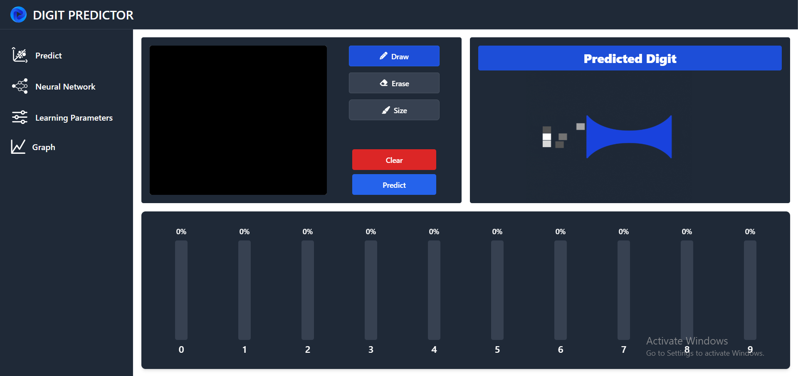
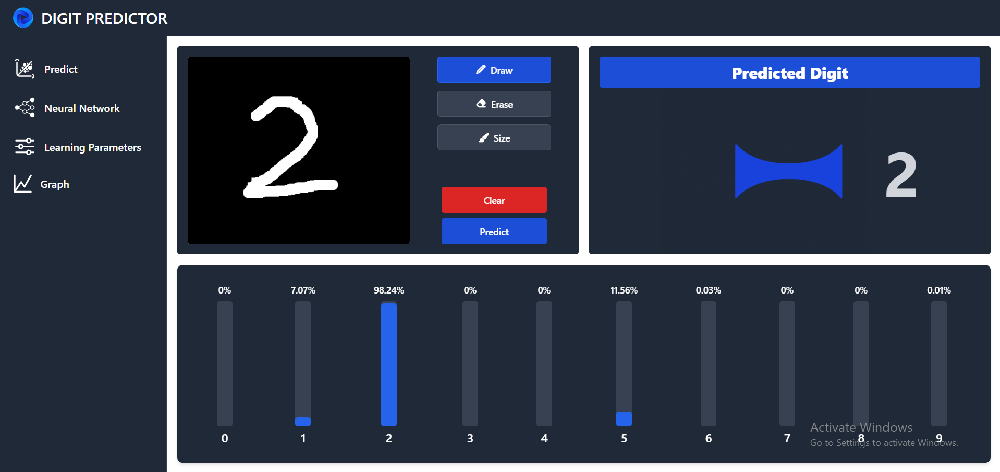
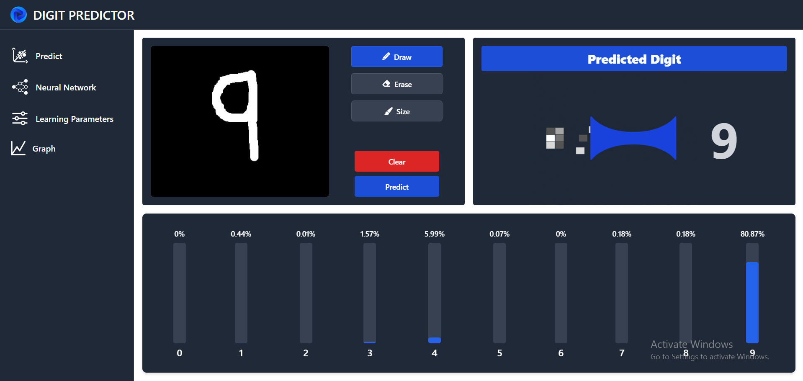
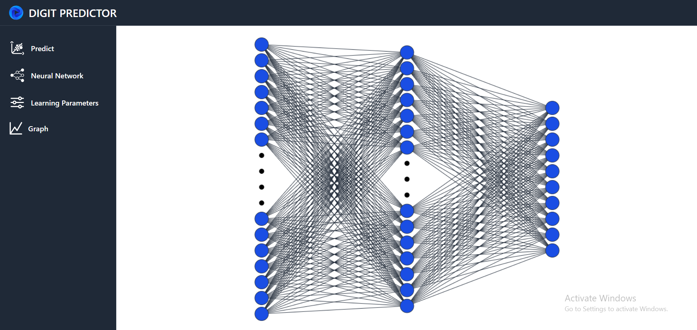
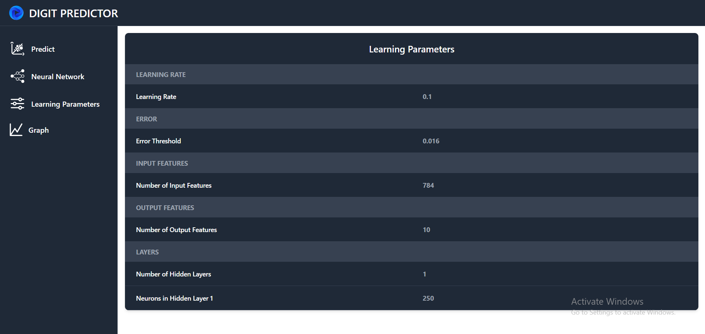
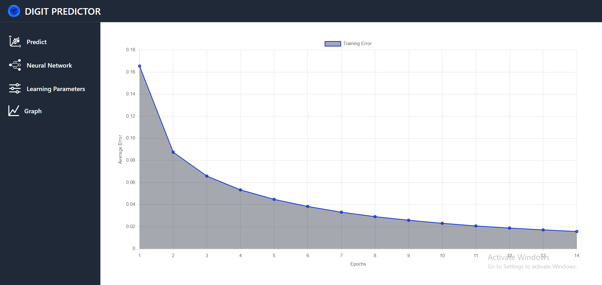

# 🖋️ **Digit Recognition System**

Welcome to the Digit Recognition System, a Django-based web application crafted to recognize handwritten digits with precision and efficiency. This innovative application bridges the gap between machine learning and user interactivity, allowing seamless digit recognition through a custom neural network model integrated into an interactive web interface.

---

## 📜 **Table of Contents**

1. [Overview](#-overview)
2. [Features](#-features)
3. [Screenshots](#-screenshots)
4. [Getting Started](#-getting-started)
5. [Technical Details](#-technical-details)
6. [Usage](#-usage)
7. [Dependencies](#-dependencies)
8. [Contributors](#-contributors)

---

## 📜 **Overview**

The Digit Recognition System is designed to recognize and predict handwritten digits in real-time. Users can draw digits on an interactive canvas, which the system processes using a custom-trained neural network built from scratch. This project demonstrates the integration of model training, prediction, and deployment, providing a seamless user experience powered by the MNIST dataset and Django framework. It also showcases the potential of machine learning in interactive applications.

---

## ✨ **Features**

### **Custom Neural Network** 🧠
  - Implemented and trained from scratch using backpropagation with gradient descent.
  - Built on the **MNIST** dataset, which consists of grayscale 28x28 images of handwritten digits.

### **Digit Drawing Canvas** 🖌️
  - Interactive web interface allowing users to draw digits for immediate prediction.
  
### **Real-Time Predictions** 🚀
  - The system predicts drawn digits as soon as the user finishes drawing, providing instant feedback.
  - Uses the trained neural network for inference directly in the web application.

### **Neural Network Visualization** 🔍
  - Visualize the neurons and their connections in the neural network.
    
---

## 📸 **Screenshots**













---

## 🚀 **Getting Started**

### 1. Clone the Repository:

```bash
git clone https://github.com/USMAN-FAIZYAB-KHAN/Digit-Recognition.git
cd Digit-Recognition
```

### 2. Install Dependencies:

Ensure **Python** and **pip** are installed. Then, install the required dependencies using pip:

```bash
pip install django numpy tensorflow
```

### 3. **Train the Model (Optional):**

If you'd like to retrain the model with updated settings or hyperparameters:

```bash
python neural_network.py
```

The model will be trained using the MNIST dataset, and a saved **pickle** file (`digit_recognition_model.pkl`) will be generated for recognition. This pickle file stores the model's weights and biases, allowing for easy loading and use in predictions.

### 4. Run the Server:

Start the Django development server:

```bash
python manage.py runserver
```

### 5. Access the Application:

Once the server is running, open your web browser and navigate to:

```
http://127.0.0.1:8000
```

---

## 🗝 **Technical Details**

The **Digit Recognition System** employs a custom neural network with the following components:

### 1. Network Architecture
- **Input Layer (784 neurons):** Processes 28x28 pixel images flattened into 784 values.
- **Hidden Layer (250 neurons):** Extracts features using the sigmoid activation function.
- **Output Layer (10 neurons):** Predicts digits 0–9.

### 2. Core Algorithms
- **Sigmoid Function:** Enables non-linearity and gradient calculation for backpropagation.
- **Weight Initialization:** Randomized within [-0.5, 0.5] to prevent symmetry issues.
- **Training:** Combines forward propagation, backpropagation, and gradient descent to minimize classification error. Stops when the average error per epoch drops below a certain threshold.

### 3. Results
- Training results show a rapidly decreasing error, stabilizing as the model optimizes for accurate digit recognition.

---

## 🛠 **Usage**

1. **Draw the Digit**:
   - Use the interactive canvas on the application’s main page to draw any digit between 0–9.

2. **Submit for Prediction**:
   - Click the "Predict" button after completing your drawing.

3. **View Results**:
   - The system will process your input and display the predicted digit.

4. **Clear and Retry**:
   - Use the "Clear" button to erase the canvas and draw a new digit for prediction.

---

## 📦 **Dependencies**

The project relies on the following dependencies:

- **Django**: Web framework for the backend.
- **NumPy**: For numerical processing.
- **TensorFlow**: Used only for the MNIST dataset, not for a pre-trained model.
- **Pickle**: Built-in python library for saving and loading the model.

---

## 🤝 **Contributors**

- [**Usman Faizyab Khan**](https://github.com/USMAN-FAIZYAB-KHAN)
- [**Muhammad Owais**](https://github.com/MuhammadOwais03)
- [**Muhammad Zunain**](https://github.com/Muhammad-Zunain)
- [**Zuhaib Noor**](https://github.com/zuhaibnoor)

---

Enjoy exploring the **Digit Recognition System**! Contributions and feedback are welcome. 😊

